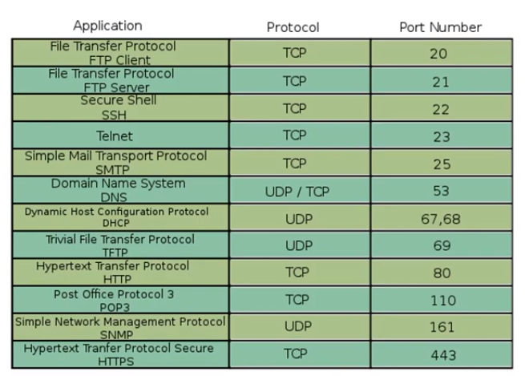

# Network Cybersecurity

## Tipos e redes

### LAN

#### Esse é o formato com o qual estamos mais habituados. A LAN (Local Area Networks) é uma rede local, ou seja, de curta distância. Ela conecta dispositivos próximos, reunidos em um mesmo ambiente, por exemplo, o escritório de uma PME ou uma residência.

### CAN

#### A CAN (Campus Area Network) – ou seja, uma rede de campus – possui um propósito bastante parecido com a LAN. Contudo, ela já possui um alcance maior.Sua utilidade é permitir a conexão entre redes de um mesmo complexo ou condomínio, como universidades, hospitais e centros comerciais.

### MAN

#### Para conectar as redes locais dentro de distâncias maiores, você pode utilizar a MAN (Metropolitan Area Network), que significa rede metropolitana. Ela pode ser utilizada para estabelecer uma conexão entre escritório que estão em um mesmo município ou cidades vizinhas, cobrindo algumas dezenas de quilômetros.

### WAN

#### A WAN (Wide Area Network) é uma rede de longa distância. Sua cobertura é bastante superior à das redes LAN e MAN. Com ela é possível conectar equipamentos em diferentes localidades, de países até continentes.

### RAN

#### RAN é a sigla para Regional Area Network, em português, rede de área regional.Conta com alcance maior que as redes do tipo LAN e MAN, porém menor que as WAN. A conexão de alta velocidade, através de fibra ótica, é uma de suas principais características.

### PAN

#### A rede PAN (Personal Area Network), que significa rede de área pessoal, é a com maior limitação de alcance. Ela conecta apenas aparelhos que estão a uma distância curtíssima, um exemplo desse tipo de rede é o Bluetooth.

### SAN

#### Já a rede SAN (Storage Area Network), em tradução livre, rede de área para armazenamento, tem apenas uma função.Portanto, ela é a responsável por armazenar dados da rede e fazer a comunicação entre um servidor e os demais dispositivos.

### VLAN

#### A versão virtual da rede LAN, a VLAN (Virtual LAN), reúne diversas máquinas de forma lógica e não física.Sendo assim, ela é capaz de dividir uma LAN física, em diversas redes virtuais.

#### As redes de computadores sem fio

Como em qualquer outra área, as redes de computadores precisaram se adaptar ao uso das tecnologias sem fio. Além de todas as alternativas que citamos as redes LAN, MAN e WAN também contam suas versões wireless, sendo elas:

- WLAN;
- WMAN;
- WWAN.

# Protocolo de internet

### O protocolo de internet puro, ou seja, o IP, é o principal protocolo de comunicação na rede. Ele é o responsável por endereçar e encaminhar os pacotes que trafegam pela internet.

### O IP, porém, não se assegura da entrega de seus pacotes de dados. Por isso, é comum que esse protocolo seja combinado ao TCP.

### O TCP/IP é a combinação do protocolo de internet — IP — e o Protocolo de Controle de Transmissão, o Transmission Control Protocol. Juntos, eles são responsáveis pela base de envio e recebimento de dados de toda a rede.

### Esse protocolo surgiu nos anos 60 e foi desenvolvido durante pesquisas militares nos Estados Unidos para permitir a comunicação entre sistemas de computadores de centros de estudos e organizações militares.

### Com a ideia de oferecer uma troca rápida de mensagens, identificar as melhores rotas entre dois locais e encontrar rotas alternativas para essas conexões, o protocolo alcançou grande popularidade e mais tarde foi incorporado por universidades e usuários comuns.

### A pilha de protocolos TCP/IP são divididas em 4 camadas, que são aplicação, transporte, rede e interface.

### Aplicação: usada para enviar e receber dados de outros programas pela internet. Nessa camada estão os protocolos HTTP, de navegação na internet, FTP, referente à transferência de arquivos e SMPT, ligado aos e-mails;

### Transporte: camada responsável por transportar os arquivos dos pacotes recebidos pela camada de aplicação. Nesse ponto, eles são organizados e transformados em outros menores que serão enviados à rede;

### Rede: os arquivos empacotados da camada de transporte são recebidos e anexados ao IP da máquina, que envia e recebe todos os dados. Daqui, eles são enviados pela internet;

### nterface: por fim, a interface executa o recebimento ou envio de arquivos na web.

## Classes de ip

## Camadas da internet

### A maioria das descrições da Internet contém três camadas, ou níveis: a Suface web, a Deep web e a Dark web. Essas categorizações podem ser úteis e enganosas.

## VPN

### VPN significa “Virtual Private Network” (rede privada virtual): um serviço que protege sua conexão com a Internet e privacidade online. As VPNs criam um túnel criptografado para seus dados, protegem sua identidade online, oculta seu endereço de IP e permitem que você use pontos de acesso de Wi-Fi públicos com segurança.
