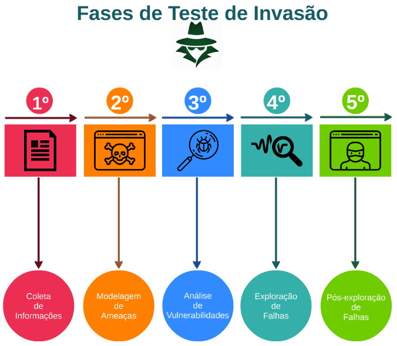

# Pentest

### Um pentest, também conhecido como penetration test, teste de intrusão ou hacking ético, é uma tática de segurança cibernética muito utilizada para identificar, testar e evidenciar vulnerabilidades em um ecossistema digital.

### Team PenTest vs Team Red

### Tipos de penTest

## Black Box

### Também conhecido como teste cego, acontece quando a equipe contratada não tem nenhuma informação primária sobre o sistema da empresa contratante. Pelo fato dos pentesters não terem conhecimento acerca da infraestrutura analisada, é a modalidade que simula de maneira mais realista um ataque hacker.

### Além disso, a modalidade “caixa preta“ pode ser feita de duas maneiras, o Blind, que é quando o cliente sabe exatamente quando a simulação de ataque será feita, e quais metodologias serão utilizadas, e o Double Blind, que é quando tanto o contratante quanto o contratado não tem nenhuma informação acerca do ataque, assim, ambos traçam a estratégia no momento em que a ação está acontecendo.

## White Box

### Entre os três tipos de pentest, é o mais requisitado entre as empresas que desejam efetuar um teste de intrusão. Neste formato, a equipe de pentesters tem conhecimento sobre toda a infraestrutura do cliente, e dessa forma, consegue traçar uma estratégia mais ampla para formalizar o ataque.

### Nesta modalidade, são simulados ataques de dentro e de fora do sistema interno da empresa contratante. Porém, é o tipo de pentest que mais exige da equipe, pois, apesar de poupar tempo e recursos utilizados, é necessário que seja entregue um relatório que possa abranger todos os problemas de maneira mais específica.

### Vale ressaltar, a modalidade “caixa branca” também conta com dois métodos, o Tandem e o Reversal, que são metodologias análogas ao que acontece no Blind e Double Blind do método Black Box.

## Gray Box

### Na modalidade “caixa cinza”, temos uma mescla dos dois tipos de pentest anteriores. Dessa forma, a equipe contratada para efetuar a análise tem conhecimento parcial da infraestrutura que será alvo de todo o processo.

### Em suma, a terceira modalidade de pentest é feita a partir das informações obtidas sobre o sistema da empresa contratante, e então, estruturam o ataque, em busca das vulnerabilidades existentes.

### Assim como nos outros dois métodos, também temos duas maneiras de efetuar esse tipo de pentest, que funcionam praticamente da mesma forma: o Gray-box e o Double Gray-box.

## Fases de penTest

