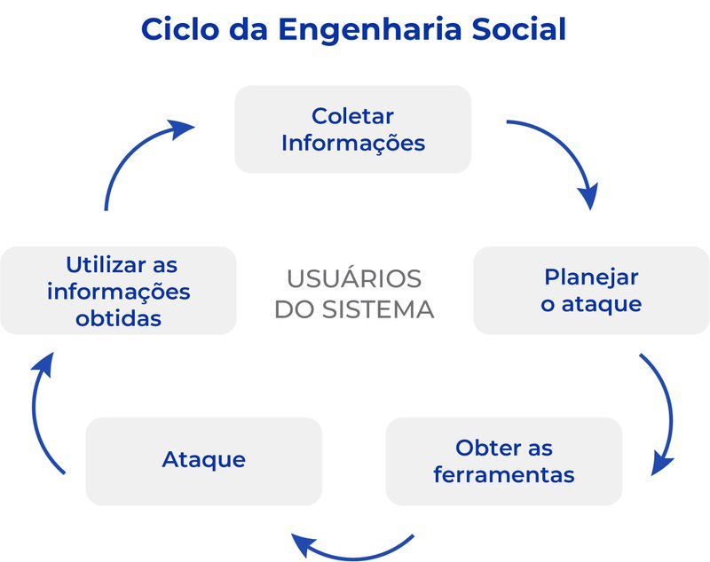
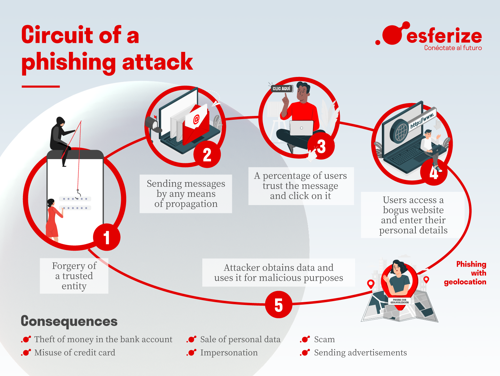
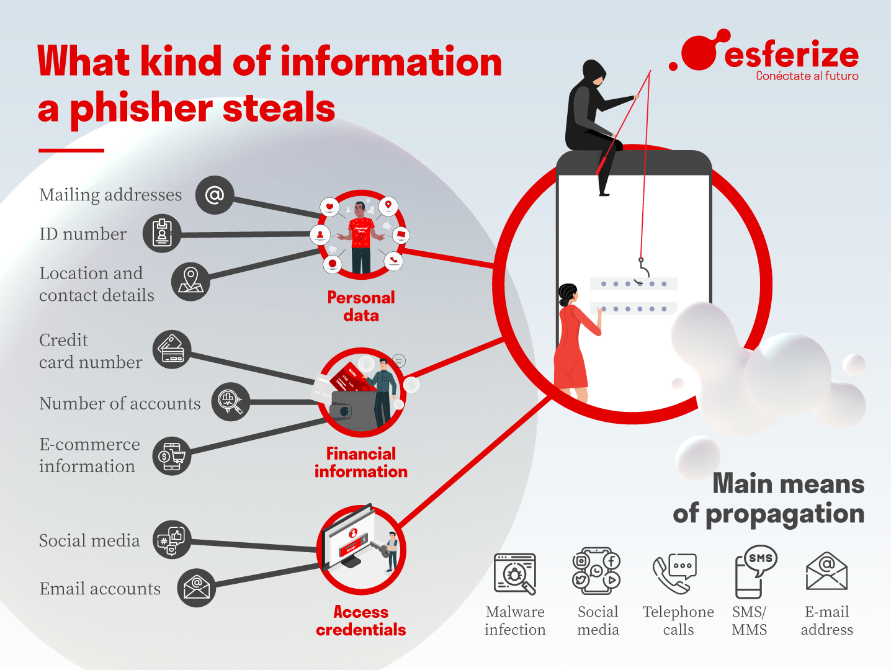

## Engenharia social

### Engenharia social é uma técnica empregada por criminosos virtuais para induzir usuários desavisados a enviar dados confidenciais, infectar seus computadores com malware ou abrir links para sites infectados. Além disso, os hackers podem tentar explorar a falta de conhecimento do usuário.

## Tipo de engenharia social

## 1. Vishing

### O vishing é uma variação do phishing, que é uma ameaça amplamente realizada nos e-mails. O vishing, em contrapartida, ocorre de forma verbal, por meio de ligações telefônicas. Para a Interpol, é um dos tipos de engenharia social que mais crescem, e que já angariou mais de 1 bilhão de dólares em fraudes, golpes e esquemas afins.

## 2. Spear Phishing

### Por meio de e-mails e mensagens, essa tática leva a páginas falsas, que se parecem com as reais, para coletar informações ou injetar malwares nos dispositivos. No Brasil, houve uma grande onda da prática, com sites que simulavam a interface da Caixa Econômica, logrando beneficiários do Auxílio Emergencial.

## 3. Pretexting

### Como sugere o nome, essa tática se baseia na criação de falsos pretextos, aparentemente positivos, para fazer com que a vítima passe informações confidenciais. No Brasil, a tática já foi muito utilizada em golpes que sugeriam a premiações, indenizações, e heranças de parentes distantes.

## 4. Sextorsion

### A sextorsão nada mais é do que uma extorsão baseada no vazamento de imagens íntimas, que podem existir ou não. A prática cresce rapidamente em todos os países, pois toca em pontos frágeis, como as noções de autopreservação, privacidade e reputação social.

### A técnica é utilizada, até mesmo, para vulnerabilizar pessoas em posições importantes dentro das empresas. Indiferentemente a terem ou não essas imagens, os invasores extorquem as vítimas, exigindo alguma condição de seu interesse para não compartilhar esses conteúdos.

## 5. Quid Pro Quo

### Quid pro Quo é uma velha expressão que sugere troca. Na cibersegurança, é o nome de uma técnica que finge oferecer algo para a vítima, em troca de algo importante para quem aplica o golpe, como informações confidenciais, o que representa um risco altíssimo para as empresas.

### Sabendo o serviço de suporte usado na sua empresa, o impostor envia um e-mail para os colaboradores, emulando a interface e a comunicação desse help desk. Se der certo, ele pode receber senhas, PINs e outras informações confidenciais que desbloqueiam o acesso ao seu sistema.

## 6. Tailgating

### No trânsito, tailgating é a prática de “andar colado” ao veículo da frente. Na engenharia social, é algo semelhante, pois implica em aproveitar essa mesma proximidade para acessar ambientes restritos em uma empresa. Imagine um prédio que tenha controle de acesso por meio de RFID.

### Fazendo-se passar por um colega, o invasor pode acessar o perímetro, aproveitando a gentileza do colaborador que deixa a porta aberta para ele passar. Por isso, é importante investir em boas práticas de segurança patrimonial e física.

## 7. Dumpster Diving

### Por último, o mergulho na lixeira. Apesar de inusitada, a prática é altamente eficiente e perigosa, tanto para as empresas como para as pessoas. A técnica consiste em revirar a papelada descartada pelo alvo em busca de informações confidenciais e sigilosas.

## Phishing

### Phishing é uma técnica de engenharia social usada para enganar usuários de internet usando fraude eletrônica para obter informações confidenciais, como nome de usuário, senha e detalhes do cartão de crédito.

### Fluxo de um phishing

### Informações que um cracker phishing rouba

